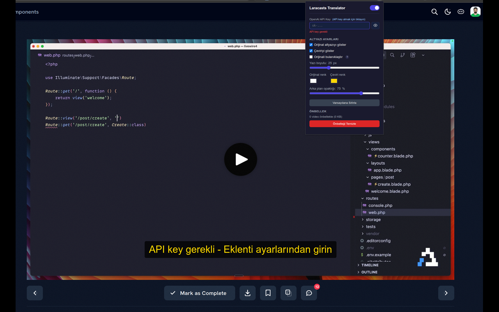
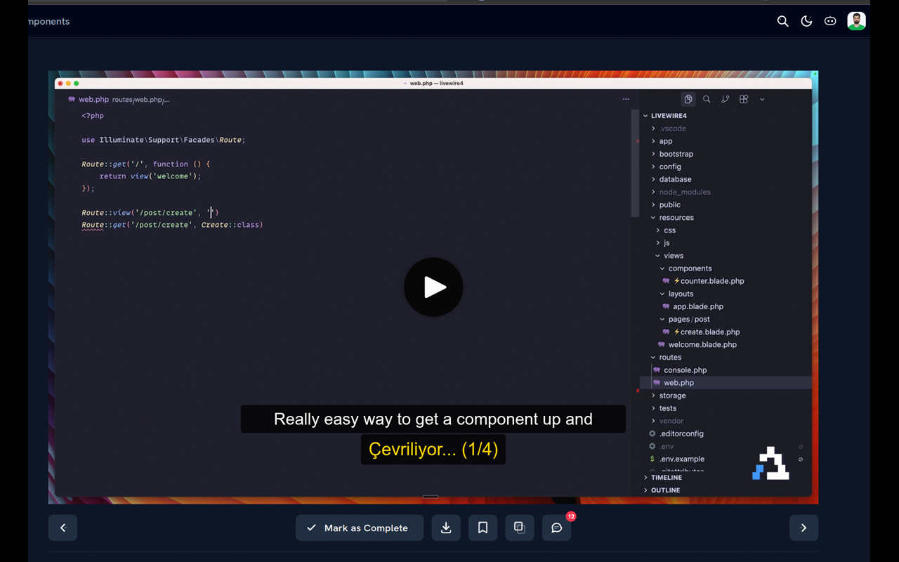
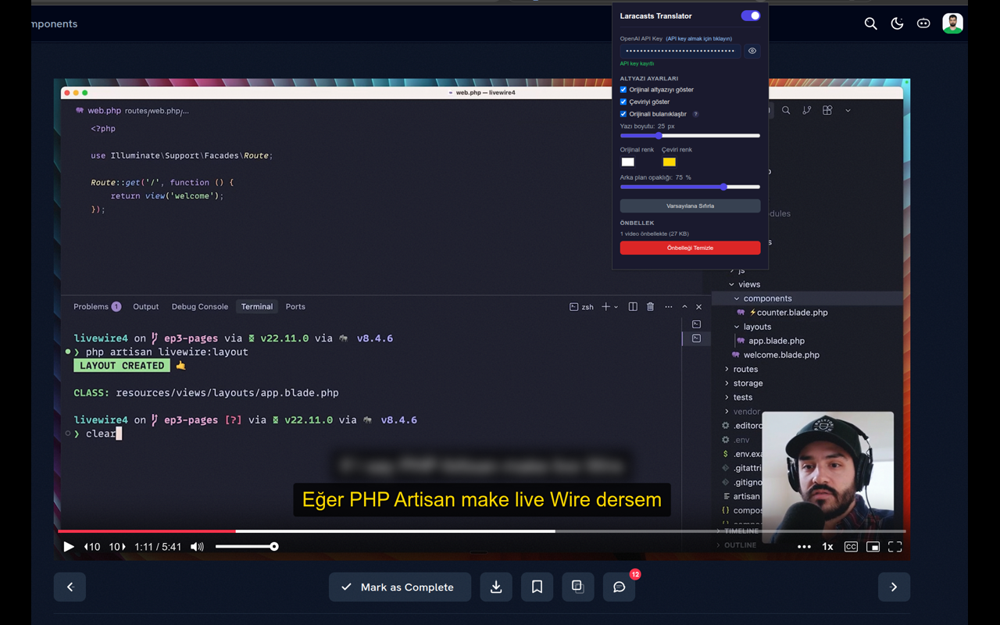
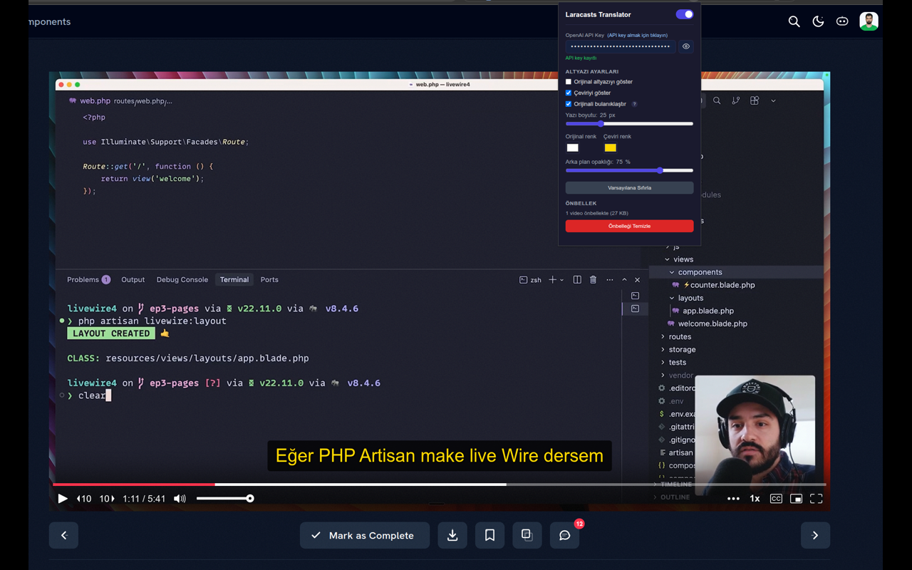
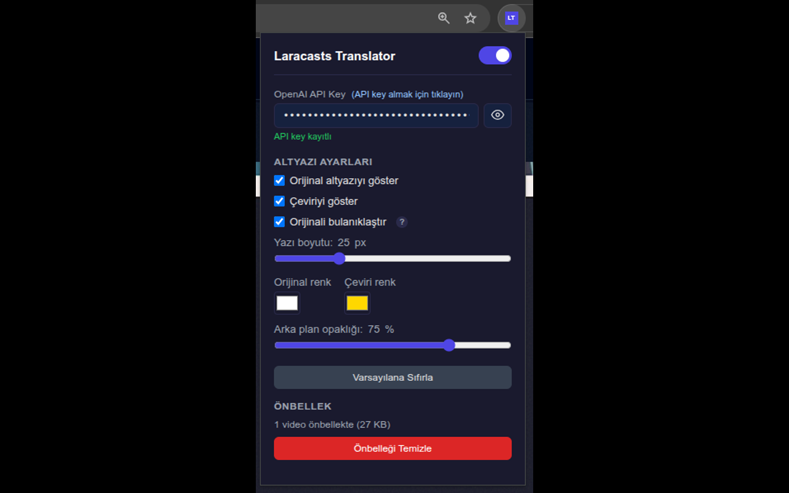

<p align="center">
  
</p>

<h1 align="center">Laracasts Translator</h1>

<p align="center">
  Laracasts video derslerindeki İngilizce altyazıları gerçek zamanlı olarak Türkçeye çeviren Chrome eklentisi.
</p>

<p align="center">
  
  
  
  
  
  
</p>

---

## Ekran Görüntüleri

### API Key Uyarısı

API key girilmemişse video üzerinde anlaşılır bir uyarı gösterilir ve kullanıcı popup'a yönlendirilir.



### Çeviri İlerlemesi

Çeviri başladığı anda altyazı altında batch bazlı ilerleme göstergesi görünür (`Çeviriliyor... (1/4)`).



### Çift Altyazı Gösterimi (EN + TR)

Orijinal (beyaz) ve Türkçe çeviri (altın sarı) aynı anda ekranda gösterilir.


### Öğrenme Modu — Orijinali Bulanıklaştır

Orijinal altyazı bulanık gösterilir, fare üzerine gelince netleşir. Türkçe önce anlamak, ardından İngilizce metne bakarak dil pratiği yapmak için idealdir.



### Sadece Türkçe Altyazı

Orijinal altyazı tamamen gizlenebilir, yalnızca Türkçe çeviri gösterilir.



### Popup Ayarları

API key, altyazı görünümü, renkler, yazı boyutu, öğrenme modu ve önbellek yönetimi tek ekrandan kontrol edilir.



## Özellikler

- **Gerçek zamanlı çeviri** - Video oynatılırken altyazılar anında Türkçeye çevrilir (çeviri tamamlandıkça)
- **Çift altyazı gösterimi** - Orijinal (İngilizce) ve çeviri (Türkçe) aynı anda ekranda
- **Öğrenme modu (bulanıklaştırma)** - Orijinal altyazı bulanık görünür, fare üzerine gelince netleşir; önce anlamaya
  odaklanıp sonra İngilizce metni kontrol etmeyi kolaylaştırır
- **Batch çeviri** - Altyazılar 50'lik gruplar halinde verimli şekilde çevrilir
- **Progressive güncelleme** - Her batch tamamlandığında çeviriler hemen gösterilir, tamamının bitmesi beklenmez
- **Akıllı önbellek** - Çevrilen altyazılar local storage'da saklanır, aynı video tekrar açıldığında API çağrısı
  yapılmaz
- **Önbellek yönetimi UI** - Popup'tan önbellekteki video sayısı ve toplam boyut görüntülenir, tek tıklamayla temizlenir
- **VTT fingerprint doğrulama** - Altyazı içeriği değiştiyse eski önbellek otomatik geçersiz sayılır
- **LRU kota yönetimi** - Depolama kotası aşıldığında en eski önbellek kayıtları otomatik temizlenir
- **API key uyarısı** - Key girilmediyse video üzerinde görünür uyarı gösterilir, kullanıcı popup'a yönlendirilir
- **Özelleştirilebilir görünüm** - Yazı boyutu, renkler ve arka plan opaklığı popup'tan ayarlanabilir
- **SPA navigasyon takibi** - Laracasts'in tek sayfa uygulama yapısı desteklenir, sayfa yenilemeden video değişimlerinde
  çeviri devam eder
- **Otomatik yeniden deneme** - Başarısız API çağrıları 3 denemeye kadar tekrarlanır; sayı uyuşmazlığında batch ikiye
  bölünür
- **API key güvenliği** - API anahtarı AES-GCM ile şifrelenip `chrome.storage.local` içinde saklanır
- **Prompt enjeksiyon koruması** - Role-swap ve ChatML saldırılarına karşı caption sanitizer
- **Self-disable toggle** - Kapatma düğmesi eklentiyi `chrome://extensions` seviyesinde devre dışı bırakır

## Gereksinimler

| Gereksinim           | Detay                                                                        |
|----------------------|------------------------------------------------------------------------------|
| **Google Chrome**    | v116 veya üzeri                                                              |
| **OpenAI API key**   | [platform.openai.com](https://platform.openai.com/api-keys) üzerinden alınır |
| **Laracasts hesabı** | Video içeriklerine erişim için aktif üyelik                                  |

## Kurulum

### Yöntem 1: Geliştirici Modu (Önerilen)

1. Bu repoyu klonlayın:
   ```bash
   git clone https://github.com/erhanurgun/laracasts-translator.git
   ```
2. Chrome'da `chrome://extensions` adresine gidin
3. Sağ üstten **Geliştirici modu**'nu açın
4. **Paketlenmemiş yükle** butonuna tıklayın ve klonlanan klasörü seçin

### Yöntem 2: Release Paketi

1. [Releases](https://github.com/erhanurgun/laracasts-translator/releases) sayfasından son sürümün `.zip` dosyasını
   indirin
2. ZIP dosyasını bir klasöre çıkarın
3. Chrome'da `chrome://extensions` → **Paketlenmemiş yükle** ile çıkarılan klasörü seçin

### Yöntem 3: Chrome Web Store

> Chrome Web Store'dan indirin: [Laracasts Translator](https://chromewebstore.google.com/detail/laracasts-translator/kacbkmbepbnoigdaingpbooplgclaffn)

## API Key Kurulumu

1. [platform.openai.com](https://platform.openai.com/api-keys) adresine gidin ve hesabınıza giriş yapın
2. Sol menüden **API keys** bölümüne gidin
3. **Create new secret key** butonuna tıklayın
4. Oluşturulan anahtarı kopyalayın (`sk-` ile başlar)
5. Chrome araç çubuğundaki `Laracasts Translator` (LT) simgesine tıklayın
6. **OpenAI API Key** alanına anahtarı yapıştırın - otomatik kaydedilir

> **Ücret uyarısı:** OpenAI API kullanımı ücretlidir. Çeviri başına maliyet gpt-4o modeline ve altyazı uzunluğuna
> bağlıdır. Kullanımınızı [platform.openai.com/usage](https://platform.openai.com/usage) adresinden takip edebilirsiniz.
> Bakiye yetersizse çeviri işlemi başarısız olur. Yüklemek
> için [faturalandırma sayfasını](https://platform.openai.com/account/billing) ziyaret edin.

## Kullanım

1. Eklentiyi kurun ve API key'inizi girin
2. [laracasts.com](https://laracasts.com) üzerinde herhangi bir video dersini açın
3. Video oynatıldığında altyazılar otomatik olarak çevrilmeye başlar (ilk çeviri bi tık bekletebilir!)
4. Çeviri ilerlemesi durum göstergesiyle takip edilir
5. Tamamlanan çeviriler önbelleğe alınır - aynı videoyu tekrar açtığınızda anında gösterilir (API maliyeti yok)

> Popup'taki **aç/kapat** (toggle) düğmesi ile çeviriyi istediğiniz zaman devre dışı bırakabilirsiniz.

## Yapılandırma

Popup menüsünden aşağıdaki ayarlar değiştirilebilir:

| Ayar                        | Varsayılan        | Açıklama                                                         |
|-----------------------------|-------------------|------------------------------------------------------------------|
| **Eklenti durumu**          | Açık              | Çeviriyi etkinleştir/devre dışı bırak                            |
| **Orijinal altyazı**        | Açık              | İngilizce altyazıyı göster/gizle                                 |
| **Çeviri altyazısı**        | Açık              | Türkçe altyazıyı göster/gizle                                    |
| **Orijinali bulanıklaştır** | Kapalı            | Öğrenme modu: İngilizce metin bulanık, fare üzerine gelince net  |
| **Yazı boyutu**             | 25px              | 18px – 45px arası ayarlanabilir                                  |
| **Orijinal renk**           | `#ffffff` (beyaz) | Orijinal altyazı metin rengi                                     |
| **Çeviri renk**             | `#ffd700` (altın) | Çeviri altyazı metin rengi                                       |
| **Arka plan opaklığı**      | %75               | Altyazı arka planının saydamlığı                                 |
| **Varsayılana sıfırla**     | -                 | Tüm görünüm ayarlarını fabrika değerlerine döndürür              |
| **Önbellek**                | -                 | Önbellekteki video sayısı ve toplam boyut; tek tıkla temizlenir  |

## Mimari

### Dosya Yapısı

```
laracasts-translator/
├── manifest.json                      # Chrome Extension manifest (V3)
├── background.js                      # Service Worker - OpenAI API, ayar ve cache modüllerini yükler
├── content-player.js                  # Mux Player video algılama, VTT çekme, altyazı senkronizasyonu
├── content-laracasts.js               # Laracasts sayfası - durum göstergesi, SPA takibi
├── popup.html / js / css              # Popup ayarlar arayüzü
├── lib/                               # İzole edilmiş sorumluluk modülleri (SRP)
│   ├── constants.js                   # Tüm modüllerin okuduğu tek kaynak sabitler
│   ├── cache-keys.js                  # Çeviri cache anahtar şeması (translation_<videoId>_tr)
│   ├── fingerprint.js                 # VTT içeriğinden cache doğrulama fingerprint'i
│   ├── crypto-vault.js                # AES-GCM ile API key şifreleme kasası
│   ├── origin-guard.js                # postMessage + chrome.runtime origin doğrulama
│   ├── log-sanitizer.js               # Log mesajlarındaki PII maskeleme (URL / token / Bearer)
│   ├── prompt-sanitizer.js            # OpenAI prompt injection savunması (role-swap, ChatML)
│   ├── storage.js                     # Popup tarafı Chrome Storage wrapper
│   ├── settings-bg.js                 # Service worker tarafı Settings + API key yönetimi
│   ├── translation-cache-bg.js        # Service worker tarafı çeviri cache (LRU evict)
│   ├── vtt-parser.js                  # WebVTT parser (dual-export) → {id, startTime, endTime, text}
│   ├── cue-splitter.js                # Uzun cue'ları doğal break noktalarından bölen splitter
│   ├── sentence-splitter.js           # Inertia paragraf cue'larını cümle sınırlarından böler
│   ├── batch-builder.js               # Cue dizisini 50'lik batch'lere sıralama koruyarak böler
│   ├── cue-search.js                  # Binary search ile aktif cue bulma (O(log n))
│   ├── deep-query-selector.js         # Mux Player shadow DOM'unda BFS ile element arama
│   ├── native-track-handler.js        # Player'ın kendi altyazı track'lerini devre dışı bırakır
│   ├── transcript-reader.js           # Laracasts Inertia transcriptSegments okuyucu + HTML strip
│   ├── translation-orchestrator.js    # Port + epoch/stale + retry + callback dispatch
│   └── subtitle-renderer.js           # Çift altyazı overlay factory
├── styles/
│   └── subtitle-overlay.css           # Altyazı stilleri
├── test/                              # Vitest birim testleri (her lib modülü için test dosyası)
└── icons/                             # Eklenti simgeleri (16, 32, 48, 128)
```

### Çeviri Pipeline'ı

```
VTT URL (track element)
  → fetch & parse → cue dizisi
  → 50'lik batch'lere böl
  → her batch için OpenAI API çağrısı (gpt-4o, temperature: 0)
  → numaralı satır eşleştirmesiyle map'le
  → cache'e fingerprint ile kaydet
  → port üzerinden batch sonuçlarını anında gönder
```

### Mesajlaşma

- **Port-based (long-lived):** `content-player.js` ↔ `background.js` - Çeviri progress güncellemeleri
- **Message passing (one-shot):** Ayar değişiklikleri ve durum sorguları

## Katkı

Katkıda bulunmak istiyorsanız [CONTRIBUTING.md](CONTRIBUTING.md) dosyasını inceleyin.

## Lisans

Bu proje [MIT Lisansı](LICENSE) ile lisanslanmıştır.

## Teşekkürler

- [Laracasts](https://laracasts.com) - Kaliteli PHP/Laravel eğitim içerikleri
- [OpenAI](https://openai.com) - GPT-4o çeviri motoru


---

Daha fazla bilgi için: https://erho.me
